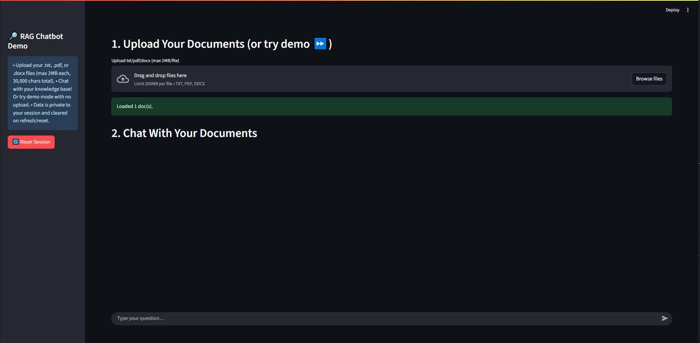

# Conversational RAG Chatbot 🤖

**An App for Exploring Retrieval-Augmented Generation on Your Own Docs**

## 🚀 Project Overview

This project is a modern, privacy-friendly chatbot app that demonstrates genuine Retrieval-Augmented Generation (RAG) in the browser. Users can securely upload their own `.txt`, `.pdf`, or `.docx` documents and have a conversation with an AI assistant that grounds its answers entirely in the user’s files, no preloaded data, no external search.

Key features include:
- True document-based RAG chat: every answer is sourced from your uploaded references.
- Instant “Demo Mode” lets anyone try the chatbot using a bundled [demo file](data/dune-summary.txt) if they prefer not to upload.
- Conversely, each session is fully private, no file, chat, or memory leaks between users.
- Seamless follow-up Q&A: the app converts every follow-up into a standalone question, letting you interact naturally.
- All processing and chat state are wiped with a single click for a refreshed, secure experience.

---

## 💡 How It Works (Tech Stack)

- **Frontend/UI:** Streamlit chat UI for smooth user interaction.
- **Document Parsing:** LangChain community loaders for TXT, PDF, DOCX.
- **Chunking & Embedding:** Fast local embedding via `sentence-transformers/all-MiniLM-L6-v2`.
- **Vector Storage:** In-memory ChromaDB per user session for similarity search (never persisted on disk, privacy by design).
- **Language Model (Q&A):** Responses powered by a state-of-the-art, cloud-hosted LLM (e.g. [MoonshotAI Kimi-K2-Instruct](https://huggingface.co/moonshotai/Kimi-K2-Instruct)) via the Hugging Face Inference API.
- **Session/state:** Strict isolation per user/session, no data cross-contamination, guaranteed.

---

## ✅ Demo Use-Cases

- Showcases RAG for recruiters/colleagues: upload a resume, handbook, or research article and chat with your own knowledge!
- Compare demo mode to real document upload, see the assistant adapt instantly.
- Safe, ephemeral environment for testing generative-AI techniques with privacy by default.

---

## 🚧 Demo Limitations & Notes

- **Speed:** Model loading and first LLM answer may take 10–30s, very normal for open RAG demos using real embeddings and cloud APIs.
- **File Limits:** Files must be .txt, .pdf, or .docx (max 2MB each, up to 30,000 total characters per session).
- **Session Lifetime:** Sessions are wiped on page reload, reset, or user tab close, for privacy, not for persistence.
- **No “real” cross-user chat:** Each user is isolated, great for privacy, but not for multiplayer chatrooms.
- **Cloud API:** All LLM completions are performed using Hugging Face’s inference API as configured; usage is subject to your account’s quota.

---

## 📦 Installation & Running Locally

1. Create a virtual environment:  
   `python -m venv doc_chat`
2. Activate the virtual environment : 
   `.\doc_chat\Scripts\activate` on Windows 
   `source .doc_chat/bin/activate` on Linux/macOS
3. Run the following command in the directory: 
   `cd rag-document-chatbot`
4. Install the required dependencies: 
   `pip install -r requirements.txt`
5. Start the app: 
   `streamlit run app.py`
6. The web UI may take 10-30 seconds to render. Once it does, upload the document (within the constrains) you want to query.
7. Talk to your document: ask questions and get answers.

---
